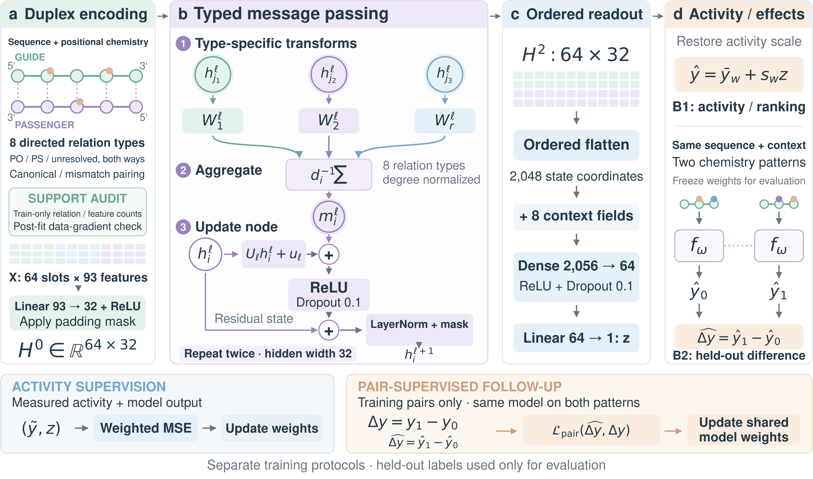

# Interaction recoverability and structured graph uncertainty

This repository records a research project on recovering selected interaction contrasts from incomplete intervention coverage, alongside earlier work on bounds for neural predictions over constrained graph families. It preserves proofs, implementation checks, frozen comparisons, and negative results. The paper figure collection is indexed in [paper/README.md](paper/README.md); its plots use saved results, with theoretical diagnostics kept separate from fitted and biological evidence.

## Current empirical siRNA study

**Do Graphs Learn the Chemistry? Controlled Evidence from siRNA Prediction** evaluates a conventional chemistry-aware GNN against published measured outcomes. The latest campaign completed 2,312 fits with ten final seeds for stochastic methods. It does not establish a general GNN advantage over the strongest fitted baseline or sequence-specific measured chemistry prediction; unfavorable results and source limitations remain explicit. APP/S7 evaluation is retrospective, and no new wet-lab validation was performed.

[Current results, code and limitations](sirna_gnn_empirical/README.md) · [Comparison tables](sirna_gnn_empirical/results/v3/tables/) · [Workflow and result figures](sirna_gnn_empirical/presentation/v3/README.md)

The supplied workflow is the paper's page-two figure. Its notation, controlled support/no-message variants and pair-loss normalization are documented with the [figure assets](sirna_gnn_empirical/presentation/v3/README.md). The empirical GNN is separate from the theoretical estimator described below.

## Separate theoretical research result

The strongest completed result is a **local asymptotically linear estimator for a two-intervention contrast from five source response laws**, with two unknown analytic profiles and four unknown coefficients. The source actions are the reference and four single interventions; the joint intervention defining the target is unobserved during estimation. The model assumes a known Gaussian latent law, a known nonlinear warp, two calibrated private unit anchors, and explicit profile normalization and smoothness restrictions.

For five independent balanced groups with total sample size `N = 5n`, the [local attainment theorem](paper/research/docs/interaction_recoverability/local_attainment/v1/theorem.md) gives an estimator whose error is an average of finite-variance source influence functions plus a remainder smaller than `N^(-1/2)` in probability. The claim holds at each fixed truth in the declared neighborhood and along the specified local parameter paths. Its construction combines empirical quantiles, a contracting anchor identity, source-only coefficient calibration, and controlled tail integration.

This is a model-specific attainment argument using established functional-estimation and empirical-process tools. It is **not** a proved general ML advantage, a sharp global minimax theorem, or a biological result. The [bounded novelty comparison](paper/research/docs/interaction_recoverability/local_attainment/v1/novelty.md) distinguishes its contribution from adjoint-range regularity, integrated quantile estimation, and recovery of strongly identified functionals.

The arithmetic qualification matters: the mathematical estimator specifies certified primitive and integration tolerances, but the delivered [reference implementation](docs/interaction_recoverability/local_attainment/v1/estimator.py) uses an uncertified `mpmath` backend and blocks sampled-data execution. Its direct construction has `N^(6+o(1))` primitive cost. The conservative sufficient quantile-domain diagnostic fails at per-source counts `10^12` and `10^32` and passes at `10^64`; these are saved schedule checks, not observations, a necessary sample-size bound, or demonstrated practical performance. Efficient variance attainment, feasible studentization, uniform neighborhood guarantees, and the global sharp rate remain open.

## Evidence and stopping decisions

| Research line | Strongest supported result | Main limitation / decision |
|---|---|---|
| [Local five-law regularity](paper/research/docs/interaction_recoverability/local_five_law/v1/proof.md) | A contracting anchor representation gives finite individual source influence norms; four coefficient duals handle the full nuisance tangent closure. | Establishes local regularity under the specified calibration assumptions; its original oracle-influence gap is addressed by the later attainment construction above. |
| [Direct target recovery](paper/research/docs/interaction_recoverability/direct_target/v1/decision.md) | Exact finite signed-weight identity and a conservative source-only consistency bound with both profiles and coefficients unknown. | A sharp attainable global rate remains **unresolved**. The naive infinite anchor formula has infinite variance; that obstruction does not rule out all five-law estimators. |
| [Learned target pilot](paper/research/docs/interaction_recoverability/learned_target_v1/adversarial_review_20260912.md) | All 24 frozen datasets and ten methods have saved predictions, including unsuccessful outcomes. | **Incremental-known.** Adaptive MSE 0.479394 versus 0.497074 for the same-fit full-bank control: a 3.56% reduction below the frozen 10% screen. Rank, optimization, and residual-bias qualifications prevent attributing this to a distinct mechanism. |
| [Actual-model P4 comparison](paper/research/docs/p4_actual_model_executed-20260911-171200-784773-final.md) | Completed nonlinear-capability, RNA prediction/ranking, and frozen-predictor verification comparisons. | **No-go for that submission route.** Capability train R² 0.1907 versus required 0.95; RNA Spearman 0.2508 versus reference 0.6475. Later verification measurements are diagnostic after the capability gate failed. |
| [Intervention-explainer preparation](paper/research/docs/intervention/README.md) | Implemented response-only operator, direct controls, data-provenance audit, and deterministic checks. | **Incremental-known:** the operator is a graph conditional neural process. The 80-row response fixture is analytic; no trained explainer or positive held-out result is claimed. |
| [Original graph-bound study](RESULTS.md) | Endpoint extremality under monotonicity and later analyses of relaxation slack over constrained families. | Historical results include untrained-network claims that were explicitly retired, coverage failures, and predictive failures. Read the scope corrections before quoting their magnitudes. |

The learned pilot's closest operational equivalence is finite-score Riesz/one-step correction with residual-driven Galerkin enrichment. Its finite direction witnesses are not whole-class uncertainty bounds. The local theorem is a separate mathematical continuation; it does not retroactively validate that learner or overturn the pilot's stopping decision.

## Repository map

| Location | Contents |
|---|---|
| [interaction_recoverability/](interaction_recoverability/) | Five-law models, deterministic identities, unknown-profile reconstruction, and preserved learned-target implementation. |
| [paper/research/docs/interaction_recoverability/](paper/research/docs/interaction_recoverability/) | Problem definitions, proofs, comparisons, audits, and versioned decisions. |
| [certmp/](certmp/) | Original monotone message-passing and edge-lattice reference code. |
| [scmp/](scmp/) | Structured-family support oracles, bounds, model components, refinement, RNA analysis, and completed revision implementations. |
| [intervention/](intervention/) | Response-only intervention operator, analytic controls, and provenance auditing. |
| [configs/](configs/) | Preserved experiment specifications and frozen comparison settings. |
| [tests/](tests/) | Correctness tests associated with these implementations; additional dependencies are recorded in [requirements-research.txt](requirements-research.txt). |
| [paper/](paper/) | Figure gallery, captions, provenance, and publication artifacts derived from existing results. |

The publication includes research code and selected scientific evidence. Task prompts and execution command logs are excluded. Historical result files retain their original scope; later decisions govern the current claims. Raw third-party assay data are not implied to be bundled by a figure or result table.

## Scope of graph and biological claims

Two endpoint evaluations are exact only over the declared edge lattice under the required monotonicity assumptions. A probability-truncated lattice need not contain every Boltzmann structure, and forced mandatory edges do not yield a sound lower bound over the full ensemble. Later structured-family methods use explicit combinatorial oracles. Their reported floating-point bounds remain `float_unverified`; exhaustive small-instance agreement is not a directed-rounding proof or evidence at arbitrary scale.

RNA prediction from a measured assay, an interaction between biological interventions, and an interaction obtained by querying a frozen GNN are different targets. A biological siRNA interaction study would need a matched reference/single/single/joint design, independent replicates, consistent chemistry and assay context, and justified private-anchor/latent-model assumptions. Those conditions have not been established here. The [siRNA requirements](paper/research/docs/interaction_recoverability/sirna_requirements.md) and [learned-pilot mapping](paper/research/docs/interaction_recoverability/learned_target_v1/sirna_mapping.md) explain the missing evidence. Synthetic fixtures and mathematical diagnostics provide no biological validation.
