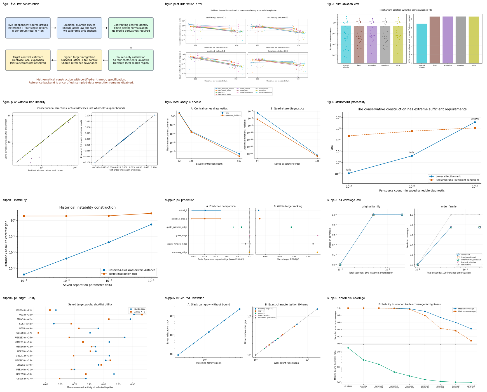

# Paper figure collection

Twelve figures cover the completed project: the direct-target construction, learned pilot, local mathematical diagnostics, and historical RNA and structured-family results. Every plotted value comes from an existing result file. This publication step ran no fits, new samples, resampling, benchmarks, or biological experiments.

The first six figures form the interaction-recoverability collection. The six supplementary figures document instability and the earlier research route, including its negative stopping evidence. They are an evidence collection, not a claim that all belong in the main text of one paper.

[Overview](figures/overview.png) · [Figure provenance and plotted data](figures/manifest.json) · [Scientific reports](research/docs/) · [Export provenance](research/export_manifest.json)

New charts have vector PDF and SVG exports plus 200-dpi PNG previews. The three archived pilot PNG/SVG pairs are unchanged; their PDF companions embed the original PNGs, so use their SVGs for vector typesetting. Lines connecting diagnostics guide the eye and are not fitted curves.

## Figures

### fig01_five_law_construction: Five-law direct-target construction

Static schematic of the saved local attainment construction. Both profiles and all four coefficients are unknown; the latent law, warp, private unit anchors and declared neighborhood are assumed known. This is a mathematical estimator specification, not an executed data analysis. Efficiency, global rates and biological applicability are not established.

[PDF](figures/fig01_five_law_construction.pdf) · [SVG](figures/fig01_five_law_construction.svg) · [PNG](figures/fig01_five_law_construction.png)

Sources: [theorem.md](../paper/research/docs/interaction_recoverability/local_attainment/v1/theorem.md).

### fig02_pilot_interaction_error: Learned pilot: interaction error

Archived figure, unchanged. All three replicates per cell are shown. The frozen pilot has 24 datasets and ten methods. This descriptive comparison does not establish a statistical rate or significance.

[PDF](figures/fig02_pilot_interaction_error.pdf) · [SVG](figures/fig02_pilot_interaction_error.svg) · [PNG](figures/fig02_pilot_interaction_error.png)

Sources: [figure1_interaction_error.png](../runs/interaction_recoverability/learned-target-v1-20260912-164000/evaluation/figure1_interaction_error.png), [figure1_interaction_error.svg](../runs/interaction_recoverability/learned-target-v1-20260912-164000/evaluation/figure1_interaction_error.svg), [raw_results.csv](../runs/interaction_recoverability/learned-target-v1-20260912-164000/evaluation/raw_results.csv), [summary.json](../runs/interaction_recoverability/learned-target-v1-20260912-164000/evaluation/summary.json), [figure_data.json](../runs/interaction_recoverability/learned-target-v1-20260912-164000/evaluation/figure_data.json).

### fig03_pilot_ablation_cost: Learned pilot: ablations and recorded costs

Archived figure, unchanged. Adaptive aggregate MSE improved by 3.5569% against the strongest complete control, below the frozen 10% screen. Shared fitted work is charged in the saved component costs; the later audit qualifies these as component accounting, not an independently optimized equal-runtime frontier.

[PDF](figures/fig03_pilot_ablation_cost.pdf) · [SVG](figures/fig03_pilot_ablation_cost.svg) · [PNG](figures/fig03_pilot_ablation_cost.png)

Sources: [figure2_ablation_cost.png](../runs/interaction_recoverability/learned-target-v1-20260912-164000/evaluation/figure2_ablation_cost.png), [figure2_ablation_cost.svg](../runs/interaction_recoverability/learned-target-v1-20260912-164000/evaluation/figure2_ablation_cost.svg), [raw_results.csv](../runs/interaction_recoverability/learned-target-v1-20260912-164000/evaluation/raw_results.csv), [summary.json](../runs/interaction_recoverability/learned-target-v1-20260912-164000/evaluation/summary.json), [figure_data.json](../runs/interaction_recoverability/learned-target-v1-20260912-164000/evaluation/figure_data.json).

### fig04_pilot_witness_nonlinearity: Learned pilot: witnesses and nonlinear remainder

Archived figure, unchanged. Finite direction witnesses are lower diagnostics, not upper uncertainty bounds over the full profile class. The observed finite-path nonlinear remainder is retained. Near-diagonal witnesses do not demonstrate the proposed mechanism.

[PDF](figures/fig04_pilot_witness_nonlinearity.pdf) · [SVG](figures/fig04_pilot_witness_nonlinearity.svg) · [PNG](figures/fig04_pilot_witness_nonlinearity.png)

Sources: [figure3_witness_nonlinearity.png](../runs/interaction_recoverability/learned-target-v1-20260912-164000/evaluation/figure3_witness_nonlinearity.png), [figure3_witness_nonlinearity.svg](../runs/interaction_recoverability/learned-target-v1-20260912-164000/evaluation/figure3_witness_nonlinearity.svg), [raw_results.csv](../runs/interaction_recoverability/learned-target-v1-20260912-164000/evaluation/raw_results.csv), [summary.json](../runs/interaction_recoverability/learned-target-v1-20260912-164000/evaluation/summary.json), [figure_data.json](../runs/interaction_recoverability/learned-target-v1-20260912-164000/evaluation/figure_data.json).

### fig05_local_analytic_checks: Local five-law analytic checks

Saved deterministic trigonometric and Gaussian-holdout fixtures. Depths and quadrature orders are the original check settings. These are reconstruction and floating-point refinement diagnostics, not empirical error rates, variance estimates, or certified integration enclosures. The earlier failed absolute-threshold check is retained in the artifact archive.

[PDF](figures/fig05_local_analytic_checks.pdf) · [SVG](figures/fig05_local_analytic_checks.svg) · [PNG](figures/fig05_local_analytic_checks.png)

Sources: [checks.json](../docs/interaction_recoverability/local_five_law/v1/checks.json).

### fig06_attainment_practicality: Attainment: sufficient-condition limitation

The three saved public-count schedule checks are plotted without rerunning the estimator. This conservative sufficient quantile-domain condition fails at n=10^12 and 10^32 and passes at n=10^64. It is not a necessary sample-size bound or a demonstrated learning curve. The saved precision requirements are 18,438, 31,725 and 52,986 bits; the reference implementation remains uncertified and sample-disabled.

[PDF](figures/fig06_attainment_practicality.pdf) · [SVG](figures/fig06_attainment_practicality.svg) · [PNG](figures/fig06_attainment_practicality.png)

Sources: [checks.json](../docs/interaction_recoverability/local_attainment/v1/checks.json).

### supp01_instability: Instability under weak separation

Saved analytic construction values show shrinking observed-axis Wasserstein distance while a target contrast gap persists. Wasserstein proximity alone is not statistical indistinguishability. The complete-experiment Hellinger argument is separate in the proof; floating-point quadrature values are not certified enclosures. This construction is distinct from the calibrated local five-law neighborhood.

[PDF](figures/supp01_instability.pdf) · [SVG](figures/supp01_instability.svg) · [PNG](figures/supp01_instability.png)

Sources: [diagnostics.json](../runs/interaction_recoverability/prep-20260912-082154/numerics-v2/diagnostics.json).

### supp02_p4_prediction: P4 prediction and ranking: negative outcome

All six saved arms, 262 held-out rows, and previously computed paired confidence intervals. No resampling was performed for this export. The model capability gate failed; these RNA comparisons are exploratory in an inferred contiguous reporter context. Actual A+B Spearman is 0.2508 versus 0.6475 for guide ridge. Prediction and ranking do not certify biological ordering.

[PDF](figures/supp02_p4_prediction.pdf) · [SVG](figures/supp02_p4_prediction.svg) · [PNG](figures/supp02_p4_prediction.png)

Sources: [p4_gpu-20260911-171200-784773-figure1_prediction_ranking.csv](../runs/revision/p4_gpu-20260911-171200-784773-figure1_prediction_ranking.csv).

### supp03_p4_coverage_cost: P4 coverage at matched total cost

All five arms and both saved strata at the primary 100-instance amortization. Overlapping curves are retained. The original family saturates at coverage 1 by 0.05 seconds; in the wider family exhaustive enumeration reaches 1 while the other arms reach 0.75. Missing gap values remain missing in the CSV. Numerical status is float_unverified and the capability gate failed, so this is a diagnostic, not learned superiority.

[PDF](figures/supp03_p4_coverage_cost.pdf) · [SVG](figures/supp03_p4_coverage_cost.svg) · [PNG](figures/supp03_p4_coverage_cost.png)

Sources: [p4_gpu-20260911-171200-784773-figure2_coverage_total_compute_v2.csv](../runs/revision/p4_gpu-20260911-171200-784773-figure2_coverage_total_compute_v2.csv).

### supp04_p4_target_utility: P4 target-level shortlist utility

All 16 saved held-out target pools with at least five candidates. Paired points are the saved selected-activity summaries for actual A+B and guide ridge. The 262-row candidate table is retained for traceability. These are observed assay selection summaries under the recorded reporter-context assumptions, not treatment recommendations, causal interaction estimates or biological certificates.

[PDF](figures/supp04_p4_target_utility.pdf) · [SVG](figures/supp04_p4_target_utility.svg) · [PNG](figures/supp04_p4_target_utility.png)

Sources: [p4_gpu-20260911-171200-784773-target_summary.csv](../runs/revision/p4_gpu-20260911-171200-784773-target_summary.csv), [p4_gpu-20260911-171200-784773-figure3_target_candidates.csv](../runs/revision/p4_gpu-20260911-171200-784773-figure3_target_candidates.csv).

### supp05_structured_relaxation: Historical structured-family relaxation

Historical C5/C7 saved diagnostics. Left: non-union-closed matching-family relaxation slack grows from 8.96 to 2290.30 across the recorded sizes. Right: the no-bias fixture gap agrees with its walk-count ratio to floating-point precision. These conditional algebraic results do not establish predictive utility or biological validity.

[PDF](figures/supp05_structured_relaxation.pdf) · [SVG](figures/supp05_structured_relaxation.svg) · [PNG](figures/supp05_structured_relaxation.png)

Sources: [c5_slack_scaling.json](../runs/20260904-034559/c5_slack_scaling.json), [c7_kappa_characterization.json](../runs/20260904-043204/c7_kappa_characterization.json).

### supp06_ensemble_coverage: Historical ensemble coverage limitation

All nine saved F7 configurations, 20,000 samples per configuration. Coverage is measured against sampled structures, not proved ensemble probability. At positive truncation floors the lattice can exclude valid structures; the saved violation counts are retained in the input JSON. Zero observed violations cannot prove soundness. These records explain why lattice exactness must not be described as universal Boltzmann-ensemble coverage.

[PDF](figures/supp06_ensemble_coverage.pdf) · [SVG](figures/supp06_ensemble_coverage.svg) · [PNG](figures/supp06_ensemble_coverage.png)

Sources: [f7_soundness.json](../runs/20260904-020253/f7_soundness.json).

## Evidence limits and retained outcomes

The published learned-pilot tables retain all 240 method-by-dataset results, together with frozen settings, aggregate diagnostics, scientific reports and the preserved implementation. Full source sample arrays, per-fold fitted parameters, checkpoints, development artifacts and evaluator-only specifications remain intact locally and are excluded from this upload. This is the archive of a completed comparison, not a fresh blind evaluation.

The failed initial local-five-law absolute-threshold check and the corrected scale-aware check are both included. Mathematical diagnostic plots do not validate a finite-sample confidence interval or an implemented root-N estimator. The reference sample-estimator entry remains disabled.

The intervention-explainer branch has analytic preparation fixtures and an incremental-known decision, so its evidence is documented in the [method](research/docs/intervention/method.md) and [preparation report](research/docs/intervention/README.md), without inventing a trained performance curve. The [historical paper tables](research/docs/paper_tables.md) retain the September 5 gates; the final P4 report governs the later no-go decision.

There is no biological interaction-validation figure because the project has no matching biological interaction experiment. No plot here converts frozen-GNN responses or synthetic fixtures into biological evidence.

## Publication boundary

Research scripts, tests, configurations, scientific reports and the saved tables supporting these figures are included. User task prompts, execution command journals, local resource ledgers, downloaded papers, third-party raw audit tables and machine-specific environment dumps remain local. Scientific Markdown copies omit execution material and record original hashes; raw scientific result files are unchanged except the explicitly identified command-field omissions in [result export provenance](result_exports.json).

The plotting-only implementation is [render_figures.py](render_figures.py). It reads the saved inputs listed in the figure manifest and refuses to overwrite an existing output directory. It imports no project learner or experiment runner. Rendering dependencies are listed in [requirements.txt](requirements.txt).
